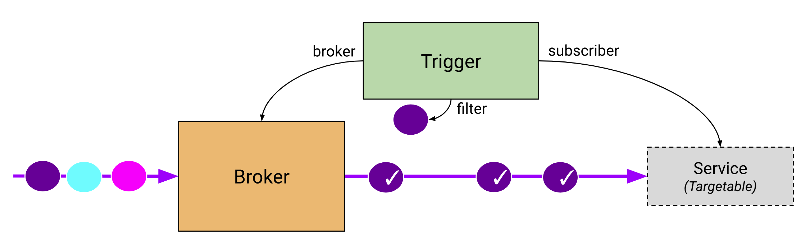
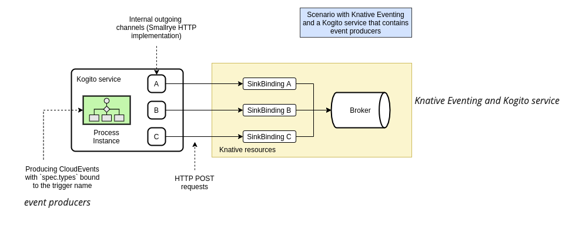

# <center> Optimize business resources with Kogito & Knative </center>


" Kogito is a platform for the development of cloud-native business automation applications. It is designed targeting cloud-native architectures, and it comes with a series of features to make it easy for architects and developers to create business applications.

As part of the Serverless Workflow implementation, Kogito offers a Kubernetes Operator to deploy these workflows with Knative. The goal is to make it as simple as possible to deploy and manage user-defined workflows in cloud environments. Knative Eventing plays a very important role in this scenario by providing the underlying infrastructure for event-driven architectures. " [[1]](#1)


<br>

## Ambition

The goal is to demonstrate how it's easy and fast to deploy a business application and optimize consumption of resources (RAM/CPU), by using kogito to build business application and knative serverless/eventing to run application only when it need it.

We will demonstrate, how it's easy to:

- deploy 3 business/kogito services that represent the eligibility, notation and offer parts of a loan  workflow.

- trigger each service through broker/trigger/"SinkBinding event source" a knative eventing resources
- trigger each service through Kafka broker/trigger/"Kafka event source" a knative eventing resources

- chain all services using Sequence Knative resource   

- run a loan "notation" (scoring) service to calculate a score only when an event comes through an http call with an CloudEvents specification.

## Broker, trigger and event source 

Knative eventing offer different ways to implement our goal :
  - by using InMemoryChannel channel-based broker , SinkBinding as an event source and trigger to dispatch to  notation service 
  - by using Kafka channel broker, Kafka event source and trigger to dispatch to  notation service     

   

What brings kogito service to simplify knative implementation?

Apart the  

     


## Deploy localy

  https://github.com/mouachan/bbank-apps/tree/1.0.x-infinispan/docker-compose

## Deploy on openshift
- Please install : 
  - oc cli : https://docs.openshift.com/container-platform/4.5/cli_reference/openshift_cli/getting-started-cli.html
  - kn cli : https://docs.openshift.com/container-platform/4.5/serverless/installing_serverless/installing-kn.html#installing-kn
  - kogito cli : https://docs.jboss.org/kogito/release/latest/html_single/#proc-kogito-operator-and-cli-installing_kogito-deploying-on-openshift


* connect to Openshift server

  ```sh
  oc login https://ocp-url:6443 -u login -p password
  ```


* Create a new namespace
  ```sh
    export PROJECT=bbankapps-kevent
    oc new-project $PROJECT
  ```

Routes include the project name, if you choose another one, don't forget to change it on the differents places/files (such kogito-realm) to use the correct urls. 

* Add a github secret to checkout sources

  ```sh
  oc create secret generic username \
      --from-literal=username=username \
      --from-literal=password=password \
      --type=kubernetes.io/basic-auth
  ```

* Add a registry secret to build pull images from quay

  ```sh
  oc create secret docker-registry quay-secret \
      --docker-server=quay.io/username \
      --docker-username=username \
      --docker-password=password\
      --docker-email=email

  oc secrets link builder quay-secret -n $PROJECT
  oc secrets link default quay-secret --for=pull -n $PROJECT
  ```

* Clone the source from github

  ```sh
  git clone -b 1.0.x-knative https://github.com/mouachan/bbank-apps.git cd bbank-apps
  export TMP_DIR=tmp
  mkdir $TMP_DIR
  ```

* Install Openshift Serverless and knative-serving 

  * install openshift-serverless operator from OperatorHub

    https://docs.openshift.com/container-platform/4.6/serverless/installing_serverless/installing-openshift-serverless.html

  * create a knative-serving and knative-eventing instance
    ```sh
    ./manifest/scripts/knative-serving.sh
    ./manifest/scripts/knative-eventing.sh
    ```

  * create the knative bkoker
    ```sh
    oc apply -f manifest/services/keventing/infra/broker.yml
    ```
  * add the event-display service to follow the cloud native events 
    ```sh
    oc apply -f manifest/services/keventing/kogito-service/event-display-service.yml
    ```


* Build the Loan Model

  ```sh
  cd model
  mvn clean install
  ```

* Deploy kogito infra and notation service

  * install Kogito operator
     

  * install the kogito-infra 

  * deploy the kogito infra 
    ```sh
    cd ..
    oc apply -f ./manifest/services/keventing/infra/kogito-knative-infra.yml -n $PROJECT
    ```

  * deploy eligibility/notation service

    ```sh
    #create the service throw kogito operator 
    oc apply -f ./manifest/services/keventing/kogito-service/eligibility-kogitoapp.yml
    cd notation
    mvn clean package  -DskipTests=true
    oc start-build eligibility --from-dir=target 
    ```
    
    ```sh
    #create the service throw kogito operator 
    cd ../notation
    oc apply -f ../manifest/services/keventing/kogito-service/notation-kogitoapp.yml
    mvn clean package  -DskipTests=true
    oc start-build notation --from-dir=target 
    ```
  * deploy a trigger to run event-display service when a notation is calculated
   
    ```sh
    oc apply -f ../manifest/services/keventing/trigger/model1-event-display-trigger.yml
    ```

* We are ready for tests, 😆

  * call the notation service
    ```sh
    curl -X POST \                                                            18:29:06
    -H "content-type: application/json"  \
    -H "ce-specversion: 1.0"  \
    -H "ce-source: /from/localhost"  \
    -H "ce-type: process.eligibility.noteapplication" \
    -H "ce-id: 12346"  \
    -d "{\"age\":3,\"amount\":50000,\"bilan\":{\"gg\":5,\"ga\":2,\"hp\":1,\"hq\":2,\"dl\":50,\"ee\":2,\"siren\":\"423646512\",\"variables\":[]},\"ca\":200000,\"eligible\":false,\"msg\":\"string\",\"nbEmployees\":10,\"notation\":{\"decoupageSectoriel\":0,\"note\":\"string\",\"orientation\":\"string\",\"score\":0,\"typeAiguillage\":\"string\"},\"publicSupport\":true,\"siren\":\"423646512\",\"typeProjet\":\"IRD\"}" \
    http://notation-bbankapps-keventing.apps.cluster-e80d.e80d.example.opentlc.com

    ```
  * Display the event catched by event-display
    ```sh
    oc logs -l serving.knative.dev/service=event-display -c user-container 
      id: 996a76c1-71eb-4da9-a614-ca8b77fee2e4
      time: 2021-02-01T18:18:36.59935Z
    Extensions,
      knativearrivaltime: 2021-02-01T18:18:36.903100944Z
      knativehistory: default-kne-trigger-kn-channel.bbankapps-kevent.svc.cluster.local
      kogitoprocessid: computeNotation
      kogitoprocessinstanceid: 0ee5bee8-cfef-4506-ab67-81695c1d2e60
      kogitoprocessinstancestate: 1
    Data, 
      {"score":0.0,"note":"A","orientation":"Approved","decoupageSectoriel":1.0,"typeAiguillage":"MODELE_1"}
    ``` 

    As you can see the event-display service is triggered  :
    ```json
     {"score":0.0,"note":"A","orientation":"Approved","decoupageSectoriel":1.0,"typeAiguillage":"MODELE_1"} 
    ```
  

## References
<a id="1">[1]</a>
By Ricardo Zanini and Tihomir Surdilovic | 17.12.2020 | 
https://knative.dev/blog/2020/12/17/orchestrating-events-with-knative-and-kogito/ 
