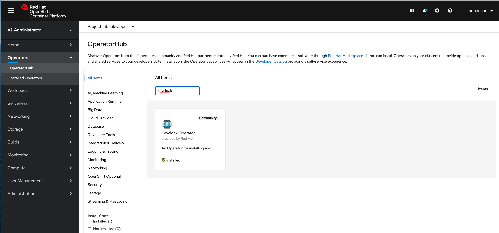

#  

# how to makes Business Users happy !

As a developper, we always have in mind the same question "What if we can avoid a long meeting with business users ? What if we can let them design the business case and just plug and play with the other pieces : build, secure, deploy  and monitor the application !"

And the same from them : « F..c… I lost my morning, I can’t remember if he talk about Streaming or API, he also said something about deploying in 2 weeks the new feature because of I don’t know what !!! Why I can’t update my rating rule in a real time ??? » 

Throw this story, we will demonstrate how can gives the hands to Business Users to create throw processes and rules a functional core of a company loan simulator. Based on the functional core, developper can build, secure and deploy the application in a few clicks/commands.

My story is around « loan validation », meaning how to simulate a loan for a company. 


*What’s a loan approval ?*

« The applicant »  - a company - request for a loan, the system get the request and start the orchestrator « loan process  » .
Then « loan process » invoke « eligibility » process to know where if the applicant could be notated or not. 
If yes « loan process » invoke the « notation »  process to calculate a Notation which is a structure composed by a calculated Score, a Note (a could be  A, B, C or D), and an Orientation (could be « Approved » « Reserve », « To Review » or  « Disapproved » . 
Getting the notation, the « loan process » make an offer for 
« the applicant » , an offer is composed by a credit rate and term  (e.g 2% and 36 months).

Clear ? Yes ? If not,  maybe this picture will gives more clarity on the orchestration between services. 

 

Let’s go detail each service :

- companies-svc service : CRUD services to manage companies on a repository (mongodb) 
- eligibility service : evaluate the eligibility of a company to have a loan throw business rules
 
- notation service : calculate a score and note throw a process and business rules 

- loan service : manage the orchestration between business services 


We finish with the functional stuff :)

*From technical perspective, what we need ?* 

 - datalake store : a mongodb instance to store company and scoring details
 - manage CRUD operation : a microservice based on quarkus, panache to manage CRUD companies and scoring operations (Rest)
 - eligibility, notation and loan services : a quarkus/kogito services to evaluate the eligibility, calculate the notation and orchestrate calls between services
 - a beautiful UI : a nodejs/react web UI to simulate the loan
 - a monitoring service : functional dashboard based on Prometheus and Grafana 
 - secure services : an SSO such as Keycloak 
 - event messaging : Kafka to manage events throws processes/services 
 - events cache : infinispan cache to manage the events store (which can give the timeline of the process execution for example) 
 - Serverless : Knative make the service scalable when is need it , it start the service only if the application receive a request 

*all services expose rest api, the processes use reactive messaging (kafka) to consume/push events, all events are stored in infinispan.*

## What’s the benefits of such architecture ?
I took some quotes from [Kogito](https://kogito.kie.org/) because I found it realistic !
  
*For Business Users*
Thanks to Kogito : Stay focused on what the business is about instead of being concerned with technology behind it.
Kogito adopts to your business domain rather than the other way around. 

*API First* 
Thanks to Quarkus/ Kogito : all api are generated throw both frameworks. 
No more leaking abstraction of the tool into your client applications.

*Super Fast and Cloud Ready*
If you think about business automation think about the cloud as this is where your business logic lives these days. By taking advantage of the latest technologies (Quarkus, knative, etc.), you get amazingly fast boot times and instant scaling on orchestration platforms like Kubernetes.
 
*Having Fun*
 At first you will be angry, then sad,  and …. you will break your laptop at the end you will be happy because it works like magic ! 

Ready ? Hands On :)

## to deploy the apps localy 

https://github.com/mouachan/bbank-apps/tree/master/docker-compose

## to deploy  the apps on openshift  
Please install : 
- oc cli : https://docs.openshift.com/container-platform/4.5/cli_reference/openshift_cli/getting-started-cli.html
- kn cli : https://docs.openshift.com/container-platform/4.5/serverless/installing_serverless/installing-kn.html#installing-kn
- kogito cli : https://docs.jboss.org/kogito/release/latest/html_single/#proc-kogito-operator-and-cli-installing_kogito-deploying-on-openshift

### connect to Openshift server

```shell
oc login https://ocp-url:6443 -u login -p password
```


### create new namespace
```shell
oc new-project bbank-apps
```

### add a github secret to checkout sources

```shell
oc create secret generic username \
    --from-literal=username=username \
    --from-literal=password=password \
    --type=kubernetes.io/basic-auth
```

### add a registry secret to build pull images from quay

``` shell
oc create secret docker-registry quay-secret \
    --docker-server=quay.io/username \
    --docker-username=username \
    --docker-password=password\
    --docker-email=email

oc secrets link builder quay-secret
oc secrets link default quay-secret --for=pull
```

### Clone the source from github
```git
git clone https://github.com/mouachan/bbank-apps.git
```

### Create a persistent mongodb 

#### Option 1 : using oc cli

```shell
#check if persistent mongo exist

oc get templates -n openshift | grep mongodb

#get paramters list
oc process --parameters -n openshift mongodb-persistent

#create the instannce
oc process mongodb-persistent -n openshift -p MONGODB_USER=admcomp -p MONGODB_PASSWORD=r3dhat2020! -p MONGODB_DATABASE=companies -p MONGODB_ADMIN_PASSWORD=r3dhat2020! \
| oc create -f -
```

#### Option 2: using Openshift UI
From Developer view, click on Add,select Database

 

From the developer catalog, click on MongoDB Template (persistent)

 

Click on Instantiate Template (use the filled values)

 

### Build the Loan Model

```shell
cd model
mvn clean install
```


### Build and deploy companies services management 

####  Create  DB and collection

Get mongo pod name
```shell
oc get pods    

NAME               READY   STATUS      RESTARTS   AGE
mongodb-1-deploy   0/1     Completed   0          40s
mongodb-1-g4mwf    1/1     Running     0          35s
```

Create the schema 
```shell
oc exec -it mongodb-1-g4mwf -- bash -c  'mongo companies -u admcomp -p r3dhat2020!' < ./manifest/scripts/create-schema.js  
```
add records
```shell
oc exec -it mongodb-1-g4mwf -- bash -c  'mongo companies -u admcomp -p r3dhat2020!' < ./manifest/scripts/insert-records.js  
```


#### Install knative-serving (serverless)

Install openshift-serverless operator from OperatorHub

Create a knative-serving instance
```shell
./manifest/scripts/knative-serving.sh
```

#### Build and deploy companies CRUD services

delete the services if exist
```shell
oc delete all,configmap,pvc,serviceaccount,rolebinding --selector app=companies-svc
```
##### option 1 : source to image build  (S2I)
```shell
oc new-app quay.io/quarkus/ubi-quarkus-native-s2i:20.1.0-java11~https://github.com/mouachan/banking-apps.git \
--name=companies-svc \
--context-dir=bbank-apps/companies-svc \
-e MONGODB_SERVICE_HOST=mongodb \
-e MONGODB_SERVICE_PORT=27017 \
--source-secret=github
```

##### option 2 :  build the container locally and push to the registry (java or native)
```shell
cd ../companies-svc
```

java
```shell
cd ../companies-svc
mvn clean package  -Dquarkus.container-image.build=true -Dquarkus.container-image.name=companies-svc -Dquarkus.container-image.tag=1.0
docker tag mouachani/companies-svc:1.0 quay.io/mouachan/companies-svc:1.0
docker push quay.io/mouachan/companies-svc:1.0
```

native 
```shell
mvn clean package  -Dquarkus.container-image.build=true -Dquarkus.container-image.name=companies-svc -Dquarkus.container-image.tag=native-1.0 -Pnative  -Dquarkus.native.container-build=true 
docker tag mouachani/companies-svc:native-1.0 quay.io/mouachan/companies-svc:native-1.0
docker push quay.io/mouachan/companies-svc:native-1.0 
```

deploy a knative service 
java
```shell
oc apply -f ../manifest/companies-svc-knative.yml 
```
native
```shell
oc apply -f ../manifest/companies-svc-native-knative.yml 
```

#### verify the service availability

Browse the url  : http://companies-svc-bbank-apps.apps.ocp4.ouachani.net/
replace .apps.ocp4.ouachani.net by your OCP url


### Build and deploy the services

#### Install Strimzi, infinispan and kogito operator

Install Infinispan/Red Hat Data Grid operator (operator version 1.1.X)

Install Strimizi operator

Install Kogito operator


#### Install data-index e.g the kogito-infra

##### Option 1 : by manifest
```shell
cd ..
oc apply -f ./manifest/services/data-index.yml
```

##### Option 2 :  by kogito cli
```shell
kogito install infinispan
kogito install kafka
```

You understood that this infra, will manage kafka topics and infinispan cache ! That’s one of the magic round I prefer, no need to worry about it. Kogito Operator will take care on topics/caches for us !

Sure there is a magic, but it needs a little configuration. Infinispan, needs the models/processes to store all actions done by the process. Below and exemple :

```protobuf
syntax = "proto2"; 
package org.kie.kogito.app; 
import "kogito-types.proto";

message Bilan { 
	option java_package = "org.redhat.bbank.model";
	optional double dl = 1; 
	optional double ee = 2; 
	optional double fl = 3; 
	optional double fm = 4; 
	optional double ga = 5; 
	optional double gg = 6; 
	optional double hn = 7; 
	optional double hp = 8; 
	optional double hq = 9; 
	optional string siren = 10; 
	repeated Variable variables = 11; 
}
message Notation { 
	option java_package = "org.redhat.bbank.model";
	optional double decoupageSectoriel = 1; 
	optional string note = 2; 
	optional string orientation = 3; 
	optional double score = 4; 
	optional string typeAiguillage = 5; 
}
message Variable { 
	option java_package = "org.redhat.bbank.model";
	optional string type = 1; 
	optional double value = 2; 
}
```


 You can found those  generated files by the quarkus/kogito when you build the services in /target/classes/persistence directory. So I create configmap protobuf models of processes : eligibility, notation, loan  and data-index for you. Let’s just create it on Openshift :

```shell
oc apply -f ./manifest/protobuf/data-index-protobuf-files.yml
```

Done ? Go to create a data-index service to index and manage all process events 

``` shell
kogito install data-index
```

We need the infinispan username and password

```shell
oc get secret/kogito-infinispan-credential -o yaml | grep ' username: ' 
==> username: ZGV2ZWxvcGVy
echo ZGV2ZWxvcGVy | base64 -d
developer
oc get secret/kogito-infinispan-credential -o yaml | grep ' password: ' 
==>  password: V1M1bDJmZnA3RHVlbUYzcw==
echo V1M1bDJmZnA3RHVlbUYzcw== | base64 -d 
WS5l2ffp7DuemF3s
```

As I said we don’t need to manage the caches and topics, but we need to specify to Kogito services kafka and infinispan properties to reach them.

Modify the values of the properties host/port to the  kafka, infinispan, data-index and companies-svc services in ./manifest/*-cm.yml also infinispan credential :
```properties
 #rest client 
    org.redhat.bbank.eligibility.rest.CompaniesRemoteService/mp-rest/url=companies-svc
    org.redhat.bbank.eligibility.rest.CompaniesRemoteService/mp-rest/scope=javax.enterprise.context.ApplicationScoped
    
    #infinispan 
    quarkus.infinispan-client.sasl-mechanism=PLAIN
    quarkus.infinispan-client.server-list=kogito-infinispan:11222
    quarkus.infinispan-client.auth-username=developer
    quarkus.infinispan-client.auth-password=jPBNvQ2uqg@xJ6Pd%

    # kafka eligibility service 
    kafka.bootstrap.servers=kogito-kafka-kafka-bootstrap.bbank-apps.svc:9092
```

Create the protobuf  and services properties config maps that’s allow to data-index to load all protobufs and to loan, eligibility, notation services to load their infra properties 

```shell
oc apply -f ./manifest/properties/eligibility-properties-cm.yml
oc apply -f ./manifest/protobuf/eligibility-protobuf-files.yml

oc apply -f ./manifest/properties/notation-properties-cm.yml
oc apply -f ./manifest/protobuf/notation-protobuf-files.yml

oc apply -f ./manifest/properties/loan-properties-cm.yml
oc apply -f ./manifest/protobuf/loan-protobuf-files.yml 
```

create  « eligibility, notation, loan » - kogito - services
``` shell
oc apply -f ./manifest/services/eligibility-kogitoapp.yml
oc apply -f ./manifest/services/notation-kogitoapp.yml
oc apply -f ./manifest/services/loan-kogitoapp.yml
```

Package and start the build
```java
cd eligibility
mvn clean package -DskipTests=true 
oc start-build eligibility --from-dir=target -n bbank-apps 

cd ../notation
mvn clean package -DskipTests=true 
oc start-build notation --from-dir=target -n bbank-apps 

cd ../loan
./mvnw clean package -DskipTests=true 
oc start-build loan --from-dir=target -n bbank-apps 

cd ..
```

## We are Ready for tests, go fin more people 😆

First get the route of the management console
```shell
oc get route management-console  
NAME                 HOST/PORT                                              PATH   SERVICES             PORT   TERMINATION   WILDCARD
management-console   *management-console-bbank-apps.apps.ocp4.ouachani.org*          management-console   8080                 None 
```

Go go go
```shell
curl -X POST "http://loan-bbank-apps.apps.ocp4.ouachani.org/loanValidation" -H  "accept: application/json" -H  "Content-Type: application/json" -d "{\"loan\":{\"age\":3,\"amount\":50000,\"bilan\":{\"gg\":5,\"ga\":2,\"hp\":1,\"hq\":2,\"dl\":50,\"ee\":2,\"siren\":\"423646512\",\"variables\":[]},\"ca\":200000,\"eligible\":false,\"msg\":\"string\",\"nbEmployees\":10,\"notation\":{\"decoupageSectoriel\":0,\"note\":\"string\",\"orientation\":\"string\",\"score\":0,\"typeAiguillage\":\"string\"},\"publicSupport\":true,\"siren\":\"423646512\",\"typeProjet\":\"IRD\"}}"
```


Now, open the management console (management-console-bbank-apps.apps.ocp4.ouachani.org) , click on « Status »,  select « Completed » and click on « Apply filter » 


Click on loan Validation process


Wawww the result is :


And the Offer details (Rate and number of months) 


Beautiful right ? Heuuu Business Users does not like curl … Okay okay let’s deploy THE WEB UI   

## The UI

We validate that all services works fine, so let’s deploy the frontend using the nodejs S2I builder  
As you can see, I add some parameters to simplify the integration :
	- a lot of labels to easily manage the app (e.g I can do an « oc delete all —Selector: 

```shell
oc new-app nodejs:12~http://github.com/mouachan/bbank-apps --context-dir=/bbank-ui  -l 'name=bbank-ui,app=bbank-ui,app.kubernetes.io/component=bbank-ui,app.kubernetes.io/instance=bbank-ui,deployment=bbank-ui' --source-secret=github -e  LOAN_VALIDATION_URL="http://loan-bbank-apps.apps.ocp4.ouachani.org/loanValidation" -e   GRAPHQL_URL="http://data-index-bbank-apps.apps.ocp4.ouachani.org/graphql"  --name=bbank-ui

```

Get the route

```shell
oc get route bbank-ui 
NAME       HOST/PORT                                    PATH   SERVICES   PORT       TERMINATION   WILDCARD
bbank-ui   bbank-ui-bbank-apps.apps.ocp4.ouachani.org          bbank-ui   8080-tcp                 None
```

If you click on submit using the filled values the result is an approved loan


Result


##  Business Users will love you 
The most things that matter to Business Users is to follow the business, meaning showing business (yes again) metrics on a wonderful dashboard.

The good point is : you don’t have anything to do, believe me :) 
 Will let Kogito listener track result and expose it as metrics :

```java
public class LoanPrometheusProcessEventListener extends PrometheusProcessEventListener {
    
    protected final Counter numberOfLoanApplicationsApproved = Counter.build()
            .name("loan_approved_total")
            .help("Approved loan applications")
            .labelNames("app_id","note", "score","rate","months" )
            .register();
    
    protected final Counter numberOfLoanApplicationsRejected = Counter.build()
            .name("loan_rejected_total")
            .help("Rejected loan applications")
            .labelNames("app_id", "reason")
            .register();

    private String identifier;
    
    public LoanPrometheusProcessEventListener(String identifier) {
        super(identifier);
        this.identifier = identifier;
    }
    
    public void cleanup() {
        CollectorRegistry.defaultRegistry.unregister(numberOfLoanApplicationsApproved);
        CollectorRegistry.defaultRegistry.unregister(numberOfLoanApplicationsRejected);
    }

    @Override
    public void afterProcessCompleted(ProcessCompletedEvent event) {
        super.afterProcessCompleted(event);
        final WorkflowProcessInstanceImpl processInstance = (WorkflowProcessInstanceImpl) event.getProcessInstance();
        if (processInstance.getProcessId().equals("loanValidation")) {
            Loan application = (Loan) processInstance.getVariable("loan");
        
            if (application.isEligible()) {
                numberOfLoanApplicationsApproved.labels(identifier, safeValue(application.getNotation().getNote()), String.valueOf(application.getNotation().getScore()), safeValue(String.valueOf(application.getRate())), safeValue(String.valueOf(application.getNbmonths()))).inc();
            } else {
                numberOfLoanApplicationsRejected.labels(identifier, safeValue(application.getMsg())).inc();
            }
        
        }
    }

    protected String safeValue(String value) {
        if (value == null) {
            return "unknown";
        }       
        return value;
    }
}
```

Prometheus, and to put the cherry on the cake, a dashboard Grafana will shows the metrics

### Install Prometheus Operator 
Install Prometheus operator throw Openshift OperatorHub and add instance from the opertaor

Expose service

```shell
oc expose svc prometheus
```
Configure prometheus

```shell yaml
oc apply -f ./manifest/services/prometheus-config.yml
```

add Service Monitor

```shell
oc apply -f ./manifest/services/prometheus-services-monitor.yml
```

Install Grafana operator Openshift OperatorHub

create instance 

```shell
oc apply -f ./manifest/services/grafana-instance.yml
```
add prometheus data-source

```shell
oc apply -f ./manifest/services/grafana-prometheus-data-source.yml
```

add the Loan Dashboard

```shell
oc apply -f ./manifest/services/grafana-loan-dashboard.yml
```

Get grafana route

```shell
oc get route | grep grafana 
grafana-route        grafana-route-bbank-apps.apps.ocp4.ouachani.org               grafana-service      3000   edge          None
```

Go to  http://grafana-route-bbank-apps.apps.ocp4.ouachani.org, you will see some metrics :


## Did I forget something ? [This section is under construction]
We build, deploy, test the application. But my boss is not happy, he said to me with « a red face » that Business User would like only login once. It means you must integrate all services to our a Single Sign On solution.  Ok Boss !
The good news is that Quarkus and Kogito comes with a SSO integration, yeah yeah no need to put a dozen of code lines.

Let’s secure communication between services ! Follow the steps :

### Install Keycloak Operator
Navigate to the OLM Web Console to navigate to the Keycloak Operator using menu on the left side and following Operators → OperatorHub. Then, focus on the search input box and type « keycloak »  : 



Next, navigate to Keycloak Operator and click on it. Next, follow the instructions on the screen. Make sure you’ve chosen « bank-apps » namespace when selecting the Subscription in the next screen.

### Create Keycloak cluster using Keycloak Operator

Once Keycloak Operator is subscribed to a « bank-apps », you can install a Keycloak installation by creating a Keycloak Custom Resource:

```shell
oc apply -f ./manifest/services/bbank-sso-instance
```

After a few minutes, Keycloak cluster should be up and running. Once the Keycloak instance is created, check if it’s ready:

```shell
oc get keycloak bbank-sso -o jsonpath=‘{.status.ready}’
true
```

### Create Keycloak Realm using Keycloak Operator

Keycloak Operator uses KeycloakRealm Custom Resources to create and manage Realm resources. Create it by using the following command:

```shell
oc apply -f ./manifest/services/bbank-sso-realm.yml
```

The above command will create a new Realm in Keycloak installation matched by instanceSelector. The newly created Realm will be named « bank-realm ».
Once the Realm is created, check if it’s ready:
```shell
oc get keycloakrealms bbank-realm -o jsonpath=‘{.status.ready}’
true 
```

### Create Keycloak User using Keycloak Operator
Keycloak Operator uses KeycloakUser Custom Resources to create and manage Users. Create it by using the following command:

```shell
 oc apply -f ./manifest/services/bbank-sso-users.yml 
```

The above command will create a new User within Keycloak Realm matched by realmSelector. The newly created User will have username set to « mouchan ». If you want to change the username , edit ./manifest/services/bbank-sso-users.yml  and change the username :

```yaml
spec:
  user:
    username: *" mouachan "*
```

Once the User is created, you may check if it’s ready:
```shell
oc get keycloakuser mouachan -o jsonpath=‘{.status.ready}’
true 
```

User’s password is stored in a Secret generated with the following pattern: credential-<realm>-<username>-<namespace> :

```shell
oc get secret  -o go-template='{{range $k,$v := .data}}{{printf " %s: "  $k}}{{if not $v}}{{$v}}{{else}}{{$v | base64 -d }}{{end}}{{" \n "}}{{end}}'
```


### Create a Client to secure App
Keycloak Operator uses KeycloakClient Custom Resources to create and manage Client resources. You may create it by using the following command:
```shell
 oc apply -f ./manifest/services/bbank-sso-
```

### Secure the management console
For Quarkus-based Kogito services, you can use the  [Quarkus OpenID Connect adapter](https://quarkus.io/guides/security-openid-connect)  with the Kogito Management Console to enable the console to interact with the Kogito Data Index Service using bearer token authorization. These tokens are issued by OpenID Connect and OAuth 2.0 compliant authorization servers such as  [Keycloak](https://www.keycloak.org/about.html) .

```yaml
kind: ConfigMap
apiVersion: v1
metadata:
  name: management-console
data:
  application.properties : |-
	  ## true means auth is disabled
    kogito.auth.enabled=false 
    kogito.auth.keycloak.url=https://keycloak-bbank-apps.apps.ocp4.ouachani.org
    kogito.auth.keycloak.realm=bbank-apps
    kogito.auth.keycloak.client.id=bbank-apps-console
```

Create the config map
```shell
oc apply -f ./manifest/properties/mgmt-console-auth.yml
```