#  


## to deploy the apps localy

https://github.com/mouachan/bbank-apps/tree/1.0.x-infinispan/docker-compose

## to deploy  the apps on openshift
Please install : 
- oc cli : https://docs.openshift.com/container-platform/4.5/cli_reference/openshift_cli/getting-started-cli.html
- kn cli : https://docs.openshift.com/container-platform/4.5/serverless/installing_serverless/installing-kn.html#installing-kn
- kogito cli : https://docs.jboss.org/kogito/release/latest/html_single/#proc-kogito-operator-and-cli-installing_kogito-deploying-on-openshift


### connect to Openshift server

```shell
oc login https://ocp-url:6443 -u login -p password
```


### create new namespace
```shell
export PROJECT=bbankapps-infinispan
oc new-project $PROJECT
```
Routes include the project name, if you choose another one, don't forget to change it on the differents places/files (such kogito-realm) to use the correct urls. 
### add a github secret to checkout sources

```shell
oc create secret generic username \
    --from-literal=username=username \
    --from-literal=password=password \
    --type=kubernetes.io/basic-auth
```

### add a registry secret to build pull images from quay

``` shell
oc create secret docker-registry quay-secret \
    --docker-server=quay.io/username \
    --docker-username=username \
    --docker-password=password\
    --docker-email=email

oc secrets link builder quay-secret -n $PROJECT
oc secrets link default quay-secret --for=pull -n $PROJECT
```

### Clone the source from github

```git
git clone -b 1.0.x-infinispan https://github.com/mouachan/bbank-apps.git cd bbank-apps
export TMP_DIR=tmp
mkdir $TMP_DIR
```


### Install RHSSO Operator
Navigate to the OLM Web Console to navigate to the RHSSO Operator using menu on the left side and following Operators → OperatorHub. Then, focus on the search input box and type « rhsso »  : 

 

Next, navigate to RHSSO Operator and click on it. Next, follow the instructions on the screen. Make sure you’ve chosen « bank » namespace when selecting the Subscription in the next screen.

### Create RHSSO instance using RHSSO Operator

Once RHSSO Operator is subscribed to a « bbank », you can install a RHSSO installation by creating a RHSSO Custom Resource:

```shell
oc apply -f ./manifest/services/rhsso/bbank-sso-instance.yml -n $PROJECT
```

After a few minutes, Keycloak cluster should be up and running. Once the RHSSO instance is created, check if it’s ready:

```shell
oc get keycloak bbank-sso -o jsonpath=‘{.status.ready}’
true
```

### Add kogito Realm

#### using oc cli
```shell
oc apply -f manifest/services/rhsso/bbank-sso-realm.yml -n $PROJECT
```
#### or manually (realm can be reset by the rhsso operator)

Get the RHSSO credential secret name
```shell
oc get secret | grep bbank-sso
credential-bbank-sso                           Opaque
```

Get the login/password
```shell
oc get secret credential-bbank-sso -o go-template='{{range $k,$v := .data}}{{printf "%s: " $k}}{{if not $v}}{{$v}}{{else}}{{$v | base64decode}}{{end}}{{"\n"}}{{end}}' -n $PROJECT
```

Get the RHSSO route
```shell
oc get route | grep keycloak
keycloak        keycloak-bbank.apps.ocp4.ouachani.org               keycloak        keycloak   reencrypt     None
```
before to create the realm, if you use another namespace name, you must change all the urls used by the clients in the ./manifest/services/kogito-realm.json or from the administration console after the realm creation. 

Access to the administration console as a admin (use the credential)
Click on  "add realm" 
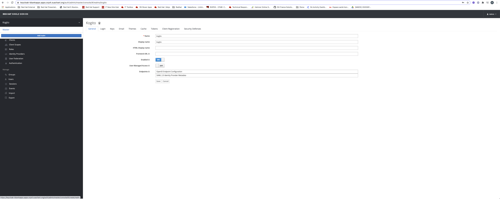  
Click on "Select file" (use the file ./manifest/services/kogito-realm.json)

import the realm from ./manifest/services/bbank-realm.json
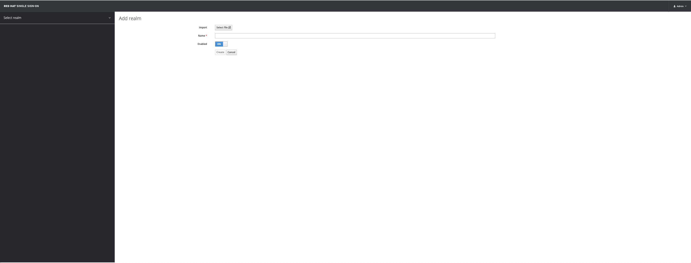  

It will create a realm "kogito", clients, users and credentials.


### Create a persistent mongodb

#### Option 1 : using oc cli

```shell
# check if persistent mongo exist

oc get templates -n $PROJECT | grep mongodb

# if not create it
oc create -f https://raw.githubusercontent.com/openshift/origin/master/examples/db-templates/mongodb-persistent-template.json -n $PROJECT

#get paramters list
oc process --parameters -n $PROJECT mongodb-persistent

#create the instannce
oc process mongodb-persistent -n $PROJECT -p MONGODB_USER=admcomp -p MONGODB_PASSWORD=r3dh4t2021! -p MONGODB_DATABASE=companies -p MONGODB_ADMIN_PASSWORD=r3dh4t2021! \
| oc create -f -
```

#### Option 2: using Openshift UI
From Developer view, click on Add,select Database

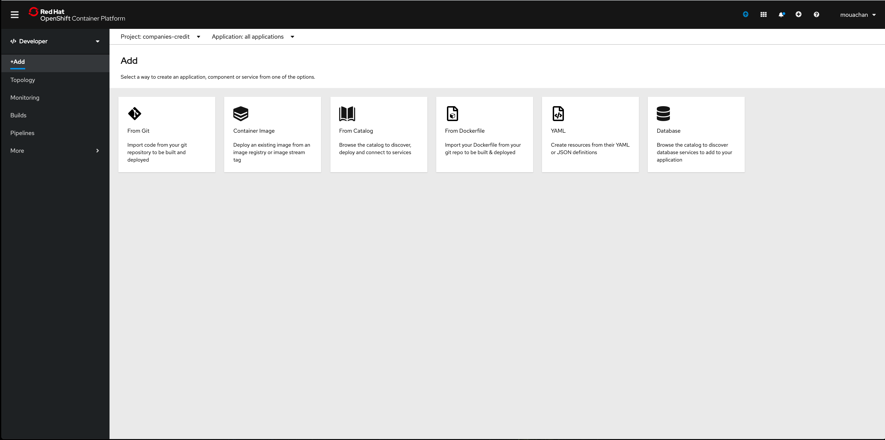 

From the developer catalog, click on MongoDB Template (persistent)

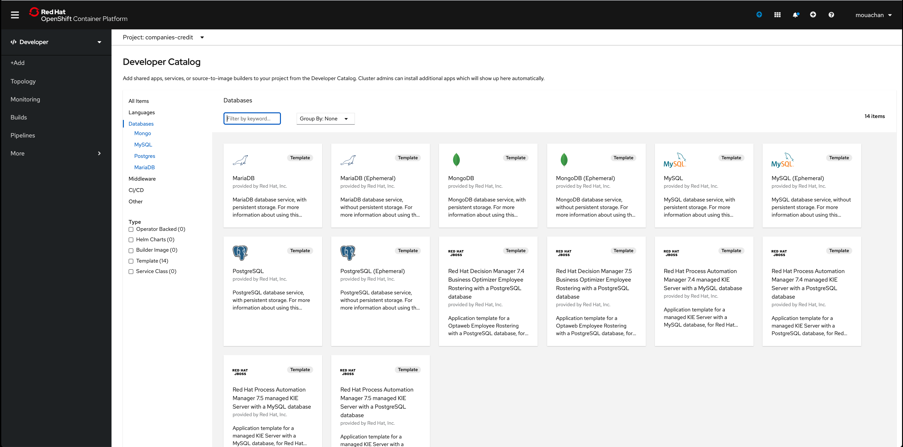 

Click on Instantiate Template (use the filled values)

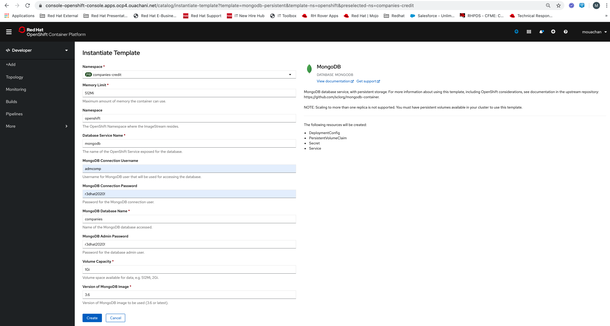 

#### wait until the mongodb is ready
```shell
oc get pods 
NAME               READY   STATUS      RESTARTS   AGE
mongodb-1-9zhxm    1/1     Running     0          41s
mongodb-1-deploy   0/1     Completed   0          47s 
```
####  Create  DB and collection

Wait until mongodb is running 
```shell
oc get pods    

NAME               READY   STATUS      RESTARTS   AGE
mongodb-1-deploy   0/1     Completed   0          40s
mongodb-1-g4mwf    1/1     Running     0          35s
```

Create the schema 
```shell
MONGO_POD_NAME=$(oc get pods --output=jsonpath={.items..metadata.name} -l 'name=mongodb')
oc exec -it $MONGO_POD_NAME -- bash -c  'mongo companies -u admcomp -p r3dh4t2021!' < ./manifest/scripts/create-schema.js  
```
add records
```shell
oc exec -it $MONGO_POD_NAME -- bash -c  'mongo companies -u admcomp -p r3dh4t2021!' < ./manifest/scripts/insert-records.js  
```
#### Install Openshift Serverless and knative-serving 

Install openshift-serverless operator from OperatorHub

https://docs.openshift.com/container-platform/4.6/serverless/installing_serverless/installing-openshift-serverless.html

Create a knative-serving instance
```shell
./manifest/scripts/knative-serving.sh
```


### Build the Loan Model

```shell
cd model
mvn clean install
```


### Build and deploy companies services management

#### Build and deploy serverless companies CRUD services

delete the services if exist
```shell
oc delete all,configmap,pvc,serviceaccount,rolebinding --selector app=companies-svc
```
##### option 1 : source to image native build (S2I)
The native build consume a lot of ressources 

```shell
oc new-app quay.io/quarkus/ubi-quarkus-native-s2i:20.1.0-java11~https://github.com/mouachan/bbank-apps.git \
--name=companies-svc \
--context-dir=companies-svc \
-e MONGODB_SERVICE_HOST=mongodb \
-e MONGODB_SERVICE_PORT=27017 \
--source-secret=github
```

##### option 2 :  build the container locally and push to the registry (java or native)
```shell
cd ../companies-svc
```

java
```shell
cd ../companies-svc
mvn clean package  -Dquarkus.container-image.build=true -Dquarkus.container-image.name=companies-svc -Dquarkus.container-image.tag=1.0
docker tag mouachani/companies-svc:1.0 quay.io/mouachan/companies-svc:1.0
docker push quay.io/mouachan/companies-svc:1.0
```

native 
```shell
mvn clean package  -Dquarkus.container-image.build=true -Dquarkus.container-image.name=companies-svc -Dquarkus.container-image.tag=native-1.0 -Pnative  -Dquarkus.native.container-build=true 
docker tag mouachani/companies-svc:native-1.0 quay.io/mouachan/companies-svc:native-1.0
docker push quay.io/mouachan/companies-svc:native-1.0 
```

deploy a knative service 
java
```shell
oc apply -f ../manifest/services/companies-svc-knative.yml 
```
native
```shell
oc apply -f ../manifest/services/companies-svc-native-knative.yml 
```
##### option 3 : use my container :)
```shell
oc apply -f ../manifest/services/companies-svc-knative.yml 
```

#### verify the service availability
Get route
```shell                                                                                                                                                                            
oc get routes.serving.knative.dev  | grep companies
companies-svc   companies-svc-bbank.apps.ocp4.ouachani.org          true
```

Browse the url  : http://companies-svc-$PROJECT.apps.ocp4.ouachani.org/

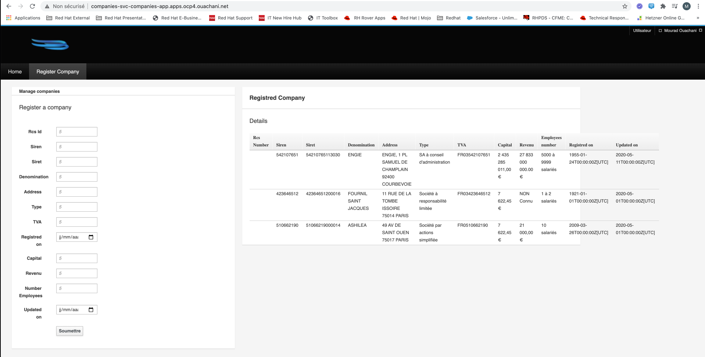 

### Build and deploy the services

#### Install Strimzi, infinispan and kogito operator

Install Infinispan/Red Hat Data Grid operator (operator version 2.0.5)
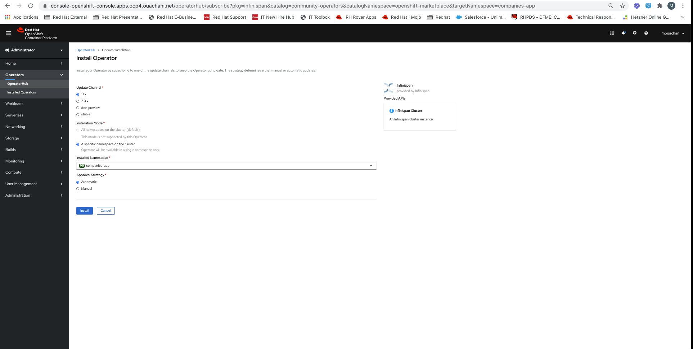 
Install Strimizi operator
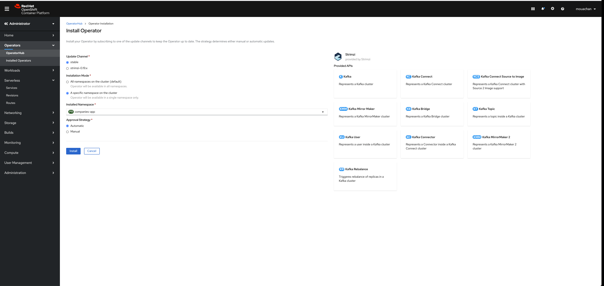 
Install Kogito operator
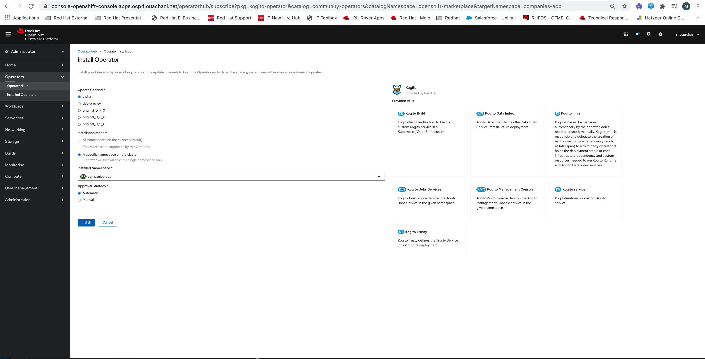 

#### Install data-index e.g the kogito-infra 

Deploy the kogito infra (infinispan and kafka)
```shell
kogito install infra kogito-infinispan-infra --kind Infinispan --apiVersion infinispan.org/v1 -p $PROJECT
kogito install infra kogito-kafka-infra --kind Kafka --apiVersion kafka.strimzi.io/v1beta1 -p $PROJECT
```

Wait until the services are running

create a data-index service

``` shell
kogito install data-index --infra kogito-infinispan-infra --infra kogito-kafka-infra -p $PROJECT 
```

This infra, will manage kafka topics and infinispan cache ! That’s one of the magic kogito I prefer, no need to worry about it. Kogito Operator will take care on topics/caches for us !

For each kogito service created, the Kogito operator will generate a configmap name nameofservice-protobuf-files that contains the protobuf of the models and processes to store all actions done by the process. 

You can find the generated protobuf in /target/classes/persistence directory of each service.

When the service is created with the property --infra, Kogito operator generates configmaps containing infinispan and kafka configuration (including the secrets)  


Deploy and configure eligibility service 
``` shell
#create the service throw kogito operator
kogito deploy-service eligibility --infra kogito-infinispan-infra --infra kogito-kafka-infra
cd eligibility
# package the eligibility service 
mvn clean package -DskipTests=true
# deploy the binaries to Openshift
oc start-build eligibility --from-dir=target -n $PROJECT 
```

Wait t

``` shell
cd ..
DATA_INDEX_URL=$(oc get route data-index --output=jsonpath={..spec.host})
echo $DATA_INDEX_URL
COMPANIES_ROUTE_URL=$(oc get routes.serving.knative.dev --output=jsonpath={..status.url})
echo $COMPANIES_ROUTE_URL
ELIGIBILITY_URL=$(oc get route eligibility --output=jsonpath={..spec.host})
echo $ELIGIBILITY_URL
cat ./manifest/properties/eligibility.properties >> ./$TMP_DIR/application.properties
sed  -i "" s~COMPANIES_ROUTE_URL~${COMPANIES_ROUTE_URL}~g ./$TMP_DIR/application.properties 
sed  -i "" s~DATA_INDEX_URL~${DATA_INDEX_URL}~g ./$TMP_DIR/application.properties
sed  -i "" s~ELIGIBILITY_URL~${ELIGIBILITY_URL}~g ./$TMP_DIR/application.properties
oc get cm eligibility-properties -o jsonpath='{.data.application\.properties}' >> ./$TMP_DIR/application.properties
oc create configmap eligibility-properties --from-file=./$TMP_DIR/application.properties --dry-run -o yaml | oc apply -f 
```

Deploy and configure notation service
 
``` shell
#create the service throw kogito operator
kogito deploy-service notation --infra kogito-infinispan-infra --infra kogito-kafka-infra
cd notation
# package the notation service 
mvn clean package -DskipTests=true
# deploy the binaries to Openshift
oc start-build notation --from-dir=target -n $PROJECT 
```
Configure notation properties

``` shell
cd ..
NOTATION_URL=$(oc get route notation --output=jsonpath={..spec.host})
echo $NOTATION_URL
cat ./manifest/properties/notation.properties >> ./$TMP_DIR/application.properties
sed  -i "" s~DATA_INDEX_URL~${DATA_INDEX_URL}~g ./$TMP_DIR/application.properties
sed  -i "" s~NOTATION_URL~${NOTATION_URL}~g ./$TMP_DIR/application.properties
oc get cm notation-properties -o jsonpath='{.data.application\.properties}' >> ./$TMP_DIR/application.properties
oc create configmap notation-properties --from-file=./$TMP_DIR/application.properties --dry-run -o yaml | oc apply -f -
rm ./$TMP_DIR/application.properties
```

Deploy and configure loan service
 
``` shell
#create the service throw kogito operator
kogito deploy-service loan --infra kogito-infinispan-infra --infra kogito-kafka-infra
cd loan
# package the notation service 
mvn clean package -DskipTests=true
# deploy the binaries to Openshift
oc start-build loan --from-dir=target -n $PROJECT 
```

Configure loan properties

``` shell
LOAN_URL=$(oc get route loan --output=jsonpath={..spec.host})
echo $LOAN_URL
cat ./manifest/properties/loan.properties >> ./$TMP_DIR/application.properties
sed  -i "" s~DATA_INDEX_URL~${DATA_INDEX_URL}~g ./$TMP_DIR/application.properties
sed  -i "" s~LOAN_URL~${LOAN_URL}~g ./$TMP_DIR/application.properties
oc get cm loan-properties -o jsonpath='{.data.application\.properties}' >> ./$TMP_DIR/application.properties
oc create configmap loan-properties --from-file=./$TMP_DIR/application.properties --dry-run -o yaml | oc apply -f -
rm ./$TMP_DIR/application.properties
```


From the kogito operator, create the management-console
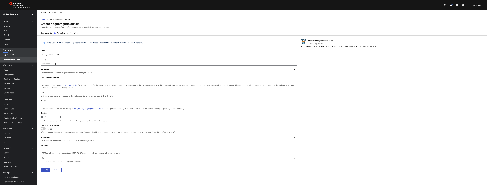 
Or using the cli
``` shell
kogito install mgmt-console -p $PROJECT
```
First get the route of the management console

```shell
oc get route management-console  
NAME                 HOST/PORT                                              PATH   SERVICES             PORT   TERMINATION   WILDCARD
management-console   management-console-bbank.apps.ocp4.ouachani.org          management-console   8080                 None 
```

Install task-console

``` shell
kogito install task-console -p $PROJECT
```

Get the task-console route
```shell
oc get route | grep task-console
task-console         task-console-bbank.apps.ocp4.ouachani.org                task-console         http                     None
```
you can access to the console using 2 users jdoe/jdoe or alice/alice
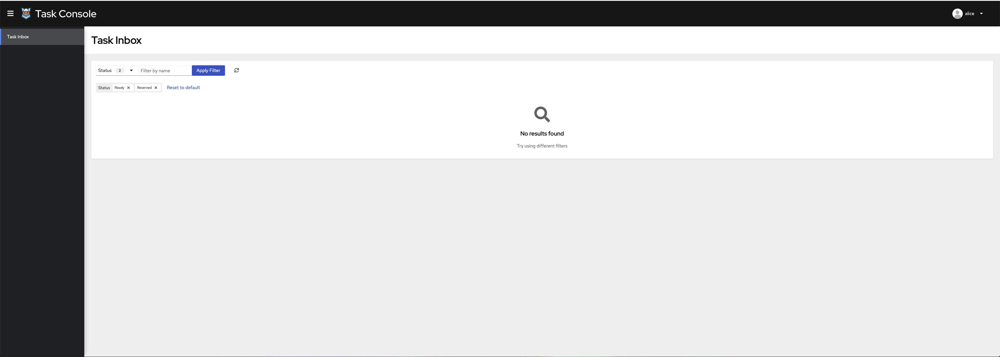 


## We are ready for tests, go find more people for help 😆


Let's execute 3 different cases :


### Loan Refused 

```shell
curl -X POST "http://loan-bbank.apps.ocp4.ouachani.org/loanValidation" -H  "accept: application/json" -H  "Content-Type: application/json" -d "{\"loan\":{\"age\":3,\"amount\":50000,\"bilan\":{\"gg\":5,\"ga\":2,\"hp\":0,\"hq\":2,\"dl\":16,\"ee\":4,\"siren\":\"423646512\",\"variables\":[]},\"ca\":200000,\"eligible\":false,\"msg\":\"string\",\"nbEmployees\":10,\"notation\":{\"decoupageSectoriel\":0,\"note\":\"string\",\"orientation\":\"string\",\"score\":0,\"typeAiguillage\":\"string\"},\"publicSupport\":false,\"siren\":\"423646512\",\"typeProjet\":\"IRD\"}}"
```

### Loan Approved with note A

curl -X POST "http://loan-bbankapps-infinispan.apps.cluster-c32b.c32b.example.opentlc.com/loanValidation" -H  "accept: application/json" -H  "Content-Type: application/json" -d "{\"loan\":{\"age\":3,\"amount\":50000,\"bilan\":{\"gg\":5,\"ga\":2,\"hp\":1,\"hq\":2,\"dl\":50,\"ee\":2,\"siren\":\"423646512\",\"variables\":[]},\"ca\":200000,\"eligible\":false,\"msg\":\"string\",\"nbEmployees\":10,\"notation\":{\"decoupageSectoriel\":0,\"note\":\"string\",\"orientation\":\"string\",\"score\":0,\"typeAiguillage\":\"string\"},\"publicSupport\":true,\"siren\":\"423646512\",\"typeProjet\":\"IRD\"}}"

```shell
curl -X POST "http://loan-bbank.apps.ocp4.ouachani.org/loanValidation" -H  "accept: application/json" -H  "Content-Type: application/json" -d "{\"loan\":{\"age\":3,\"amount\":50000,\"bilan\":{\"gg\":5,\"ga\":2,\"hp\":1,\"hq\":2,\"dl\":50,\"ee\":2,\"siren\":\"423646512\",\"variables\":[]},\"ca\":200000,\"eligible\":false,\"msg\":\"string\",\"nbEmployees\":10,\"notation\":{\"decoupageSectoriel\":0,\"note\":\"string\",\"orientation\":\"string\",\"score\":0,\"typeAiguillage\":\"string\"},\"publicSupport\":true,\"siren\":\"423646512\",\"typeProjet\":\"IRD\"}}"
```


Open the management console (management-console-bbank.apps.ocp4.ouachani.org) , click on « Status »,  select « Completed » and click on « Apply filter » 

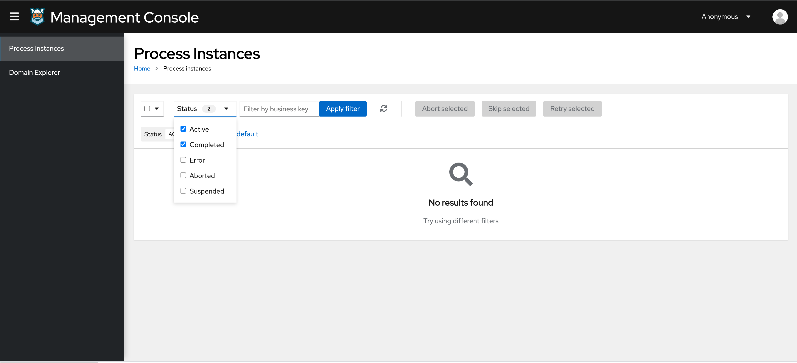 

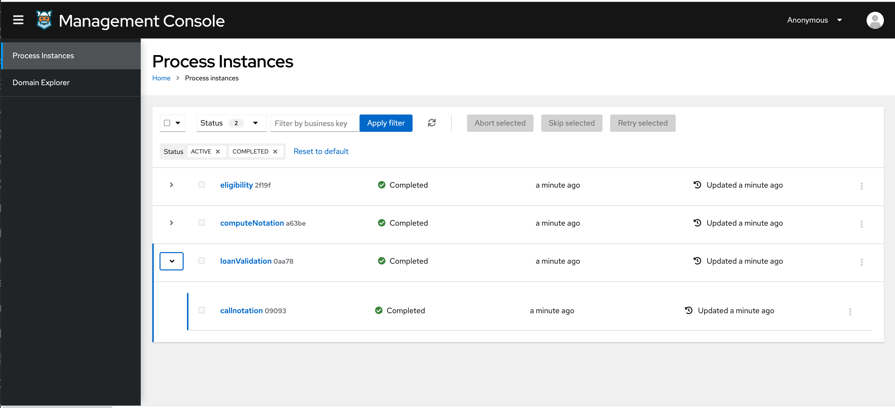 

Click on loan Validation process

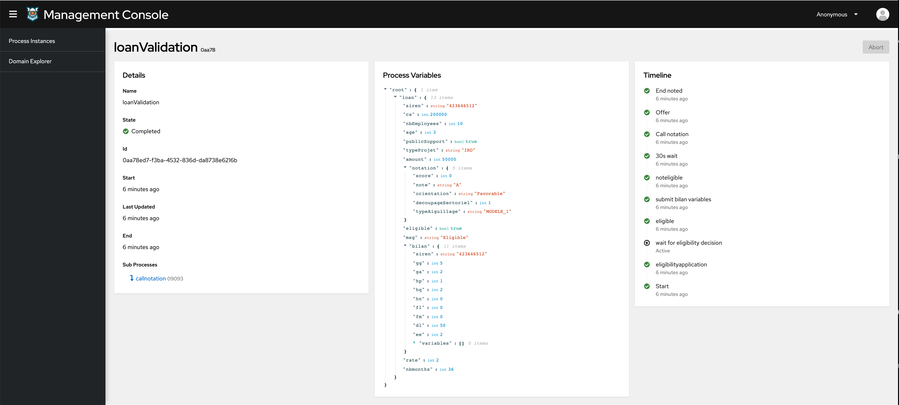 

The result is :

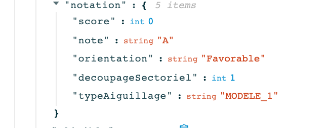 

And the Offer details (Rate and number of months) 

 


### Loan to review, approval by managers, 2 different levels of approvals : Agency and Regional

```shell
curl -X POST "http://loan-bbank.apps.ocp4.ouachani.org/loanValidation" -H  "accept: application/json" -H  "Content-Type: application/json" -d "{\"loan\":{\"age\":3,\"amount\":50000,\"bilan\":{\"gg\":5,\"ga\":2,\"hp\":1,\"hq\":2,\"dl\":12,\"ee\":2,\"siren\":\"423646512\",\"variables\":[]},\"ca\":200000,\"eligible\":false,\"msg\":\"string\",\"nbEmployees\":10,\"notation\":{\"decoupageSectoriel\":0,\"note\":\"string\",\"orientation\":\"string\",\"score\":0,\"typeAiguillage\":\"string\"},\"publicSupport\":true,\"siren\":\"423646512\",\"typeProjet\":\"IRD\"}}"
```
From management console, we can see that the process is waiting to approval from the agency
 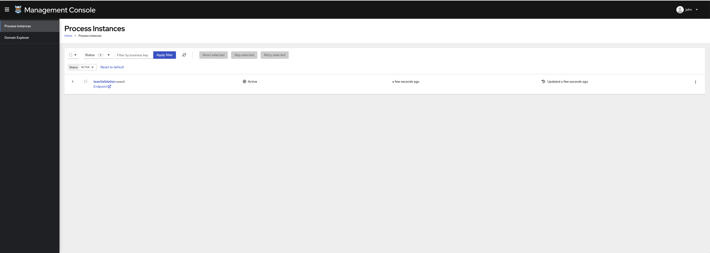 

Click on the loanValidation process to get the details, see that is waiting for an approval
 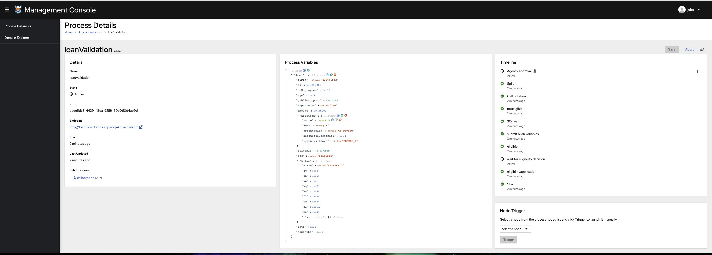

Access to the task inbox as the agency manager John (jdoe/jdoe)  
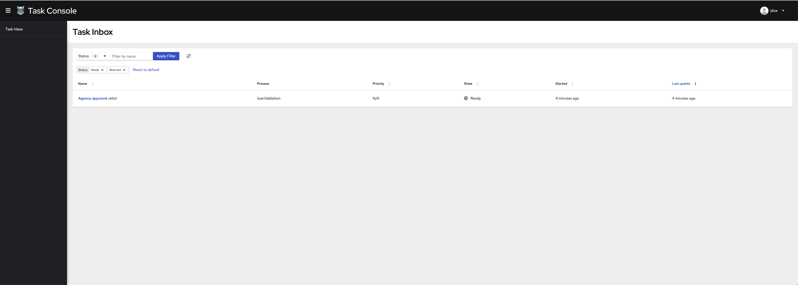

Click on the human task "Agency approval" to get the form
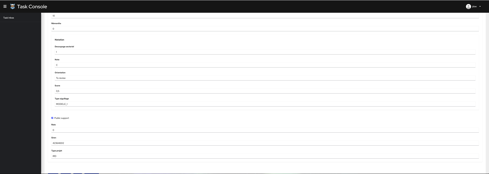

Change the following values and click on complete
Note : A
Orientation : Approved
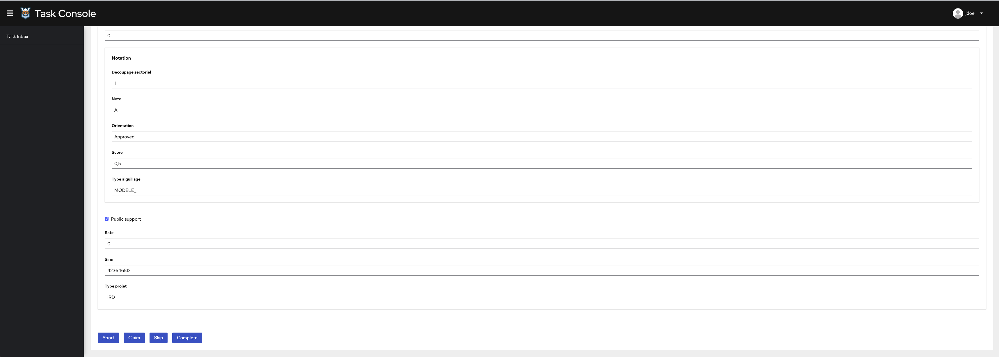

Go back to the management console, refresh, you can see that the agency approval is done, and the process is waiting for a regional approval


Back to the task console, disconnect jdoe, and connect to the console as the regional manager Alice (alice/alice)
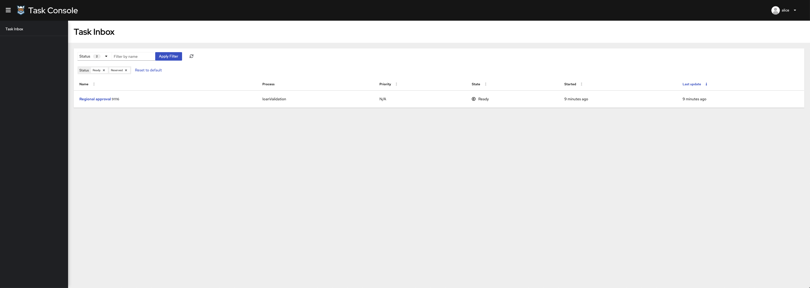
Click on the task, you will get the form. You can see that the new values are propagated to Alice for validation

Complete the task (click on Complete), go back to the managment console. The loan is approved
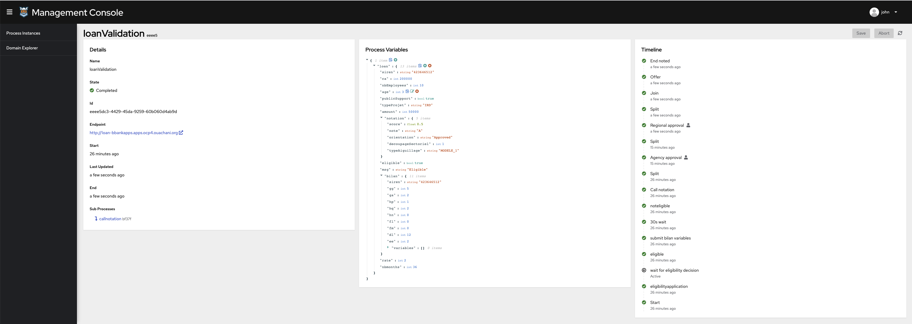  


## The UI

We validate that all services works fine, so let’s deploy the UI using nodejs S2I builder.  
 
I add some parameters to simplify the integration :

    - labels to easily manage the app
    
    - source-secret to pull the source from github
    
    - LOAN_VALIDATION_URL is used by the frontend to call « loan process »
    
    - GRAPHQL_URL is used by the frontend to get the result from infinispan by using graphql queries
    
    - name : to name the application

```shell
oc new-app nodejs:12~http://github.com/mouachan/bbank-apps --context-dir=/bbank-ui  -l 'name=bbank-ui,app=bbank-ui,app.kubernetes.io/component=bbank-ui,app.kubernetes.io/instance=bbank-ui,deployment=bbank-ui' --source-secret=github -e  LOAN_VALIDATION_URL="http://loan-bbank.apps.ocp4.ouachani.org/loanValidation" -e   GRAPHQL_URL="http://data-index-bbank.apps.ocp4.ouachani.org/graphql"  --name=bbank-ui -n bbank
```

Get the route

```shell
oc get route bbank-ui 
NAME       HOST/PORT                                    PATH   SERVICES   PORT       TERMINATION   WILDCARD
bbank-ui   bbank-ui-bbank.apps.ocp4.ouachani.org          bbank-ui   8080-tcp                 None
```

If you click on submit using the filled values the result is an approved loan
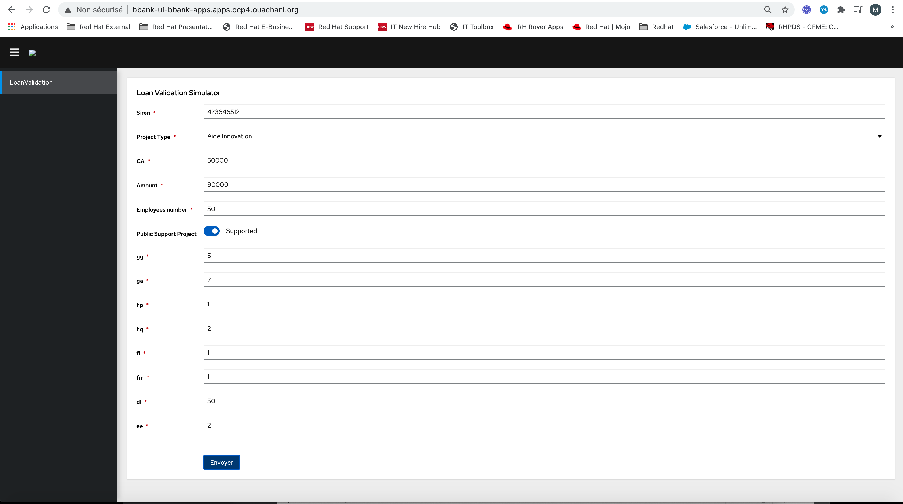 

Result
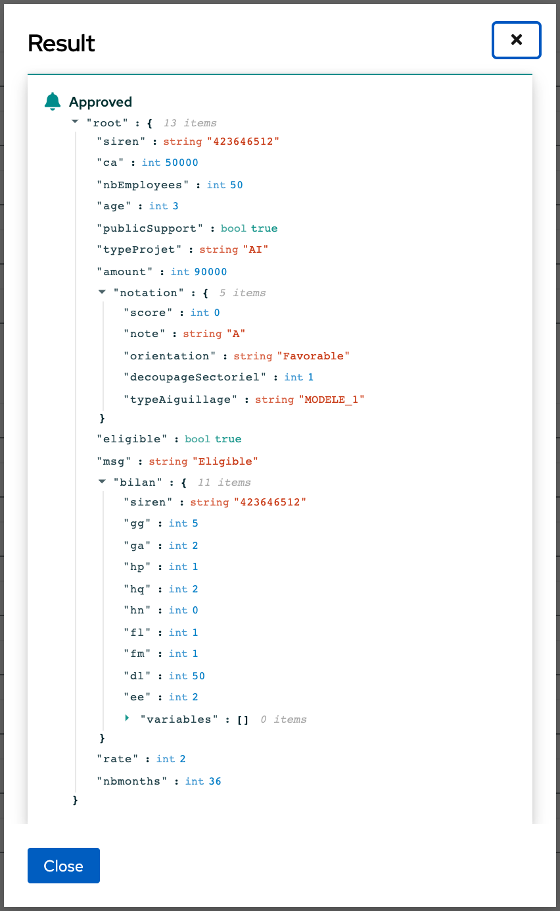 


##  Business Users will love you
The most things that matter to Business Users is to track business metrics, meaning display the business metrics on a wonderful dashboard.

The good point is : you don’t have anything to do :) 
 Kogito listener will track result and expose it as metrics.

```java
public class LoanPrometheusProcessEventListener extends PrometheusProcessEventListener {
    
    protected final Counter numberOfLoanApplicationsApproved = Counter.build()
            .name("loan_approved_total")
            .help("Approved loan applications")
            .labelNames("app_id","note", "score","rate","months" )
            .register();
    
    protected final Counter numberOfLoanApplicationsRejected = Counter.build()
            .name("loan_rejected_total")
            .help("Rejected loan applications")
            .labelNames("app_id", "reason")
            .register();

    private String identifier;
    
    public LoanPrometheusProcessEventListener(String identifier) {
        super(identifier);
        this.identifier = identifier;
    }
    
    public void cleanup() {
        CollectorRegistry.defaultRegistry.unregister(numberOfLoanApplicationsApproved);
        CollectorRegistry.defaultRegistry.unregister(numberOfLoanApplicationsRejected);
    }

    @Override
    public void afterProcessCompleted(ProcessCompletedEvent event) {
        super.afterProcessCompleted(event);
        final WorkflowProcessInstanceImpl processInstance = (WorkflowProcessInstanceImpl) event.getProcessInstance();
        if (processInstance.getProcessId().equals("loanValidation")) {
            Loan application = (Loan) processInstance.getVariable("loan");
        
            if (application.isEligible()) {
                numberOfLoanApplicationsApproved.labels(identifier, safeValue(application.getNotation().getNote()), String.valueOf(application.getNotation().getScore()), safeValue(String.valueOf(application.getRate())), safeValue(String.valueOf(application.getNbmonths()))).inc();
            } else {
                numberOfLoanApplicationsRejected.labels(identifier, safeValue(application.getMsg())).inc();
            }
        
        }
    }

    protected String safeValue(String value) {
        if (value == null) {
            return "unknown";
        }       
        return value;
    }
}
```

Metrics exposed, let’s install Prometheus and Grafana to catch metrics and show the dashboard

### Prometheus Operator

Install Prometheus operator throw Openshift OperatorHub 

Change "bbank" by your namespace name (namespace, matchNames and app properties) in the following files :
- ./manifest/services/prometheus-config.yml
- ./manifest/services/prometheus-services-monitor.yml
- ./manifest/services/grafana-instance.yml 
- ./manifest/services/grafana-prometheus-data-source.yml
- ./manifest/services/grafana-loan-dashboard.yml

Configure prometheus

```shell yaml
oc apply -f ./manifest/services/prometheus-config.yml
```

Create prometheus instance

```shell
oc apply -f ./manifest/services/prometheus-instance.yml 
```

Expose service

```shell
oc expose svc prometheus
```


add Service Monitor

```shell
oc apply -f ./manifest/services/prometheus-services-monitor.yml
```

Install Grafana operator Openshift OperatorHub

create instance 

```shell
oc apply -f ./manifest/services/grafana-instance.yml
```
add prometheus data-source

```shell
oc apply -f ./manifest/services/grafana-prometheus-data-source.yml
```

add the Loan Dashboard

```shell
oc apply -f ./manifest/services/grafana-loan-dashboard.yml
```

Get grafana route

```shell
oc get route | grep grafana 
grafana-route        grafana-route-bbank.apps.ocp4.ouachani.org               grafana-service      3000   edge          None
```

Go to  http://grafana-route-bbank.apps.ocp4.ouachani.org, you will see the metrics :

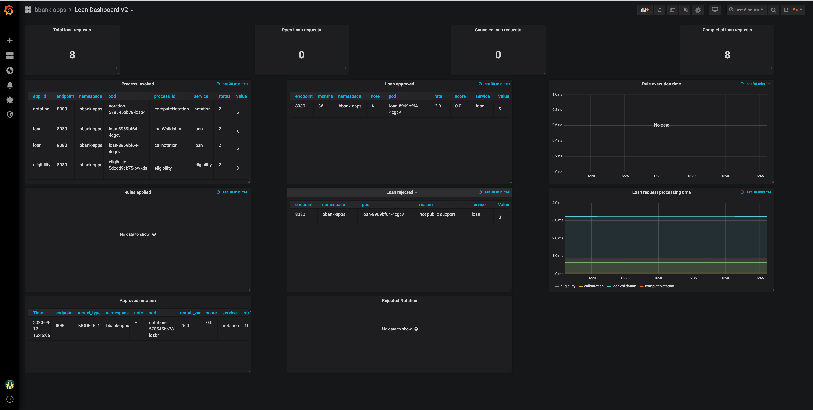 


