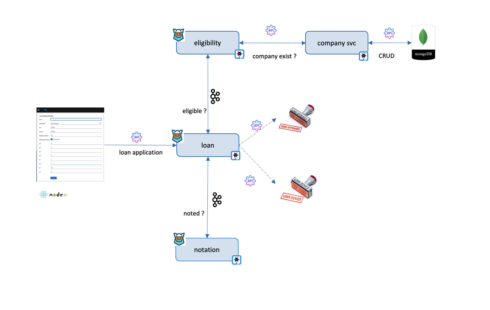
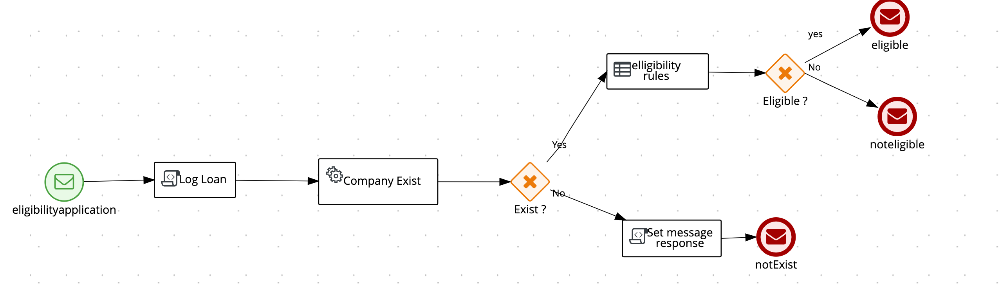
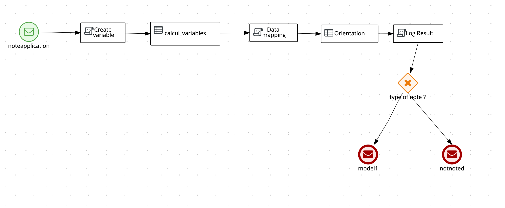
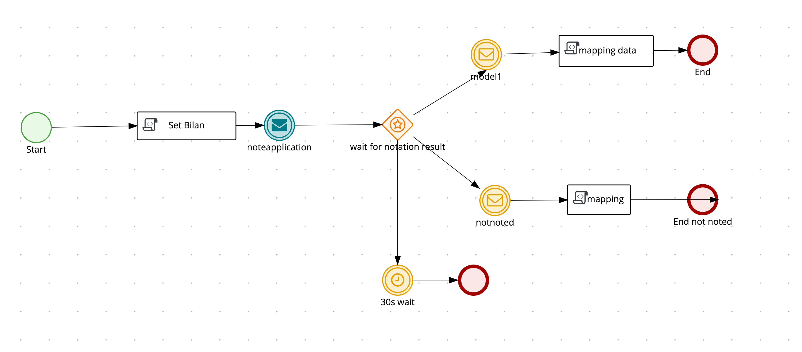

#  

# how to makes Business Users happy !

As a developper, we always have in mind the same question « What if we could avoid a long meeting with business users ? What if we could let them design the business case and just plug in and play with the other element : build, secure, deploy  and monitor the app ! »

And the same thing for operational guys : « … I wasted my morning, always same gibberish
Kafka, Streaming , API. They also said something about rolling out in 2 weeks the new feature because of I don’t know what !!! Why can’t I update my scoring rule in real time ??? » 

Throw this story, we will show how we can easily build, secure and deploy a functional core created by business users.

My story is about « loan validation », which is how to simulate a loan for a company. 

What’s a loan approval ?

“The applicant” - a company - requests a loan, the system retrieves the request and starts the “loan process” orchestrator.
Then the “loan process” invokes the “eligibility process” to find out whether the applicant can be scored or not.
If so, the “loan process” invokes the “scoring process” to calculate a Rating which is a structure composed of a calculated Score, a Note (can be A, B, C or D), and a Guidance (can be “Approved” “Reserve”, “To review” or “Disapproved”).
Finally, the « loan process » makes an offer for
« The applicant », which is composed of a credit rate and a term (for example 2% and 36 months).

If the guidance is "To review", the decision to accept or refuse the requet must be approved by 2 level of managers (agency and regional). 

Clear ? Yes ? If not,  maybe the following diagram will gives more clarity on the orchestration between services. 

 

Let’s go deeper on each service :

- companies-svc service : CRUD services to manage companies on a repository (mongodb) 
- eligibility service : evaluate the eligibility of a company to have a loan throw business rules
 
- notation service : calculate a score and note throw a process and business rules 
 
- loan service : manage the orchestration between business services 
 
 

We have finished with the functional stuff :)

*From technical perspective, what we need ?*

 - datalake store : a mongodb instance to store company and scoring details
 - manage CRUD operation : a microservice based on quarkus, panache to manage CRUD companies and scoring operations (Rest)
 - eligibility, notation and loan services : a quarkus/kogito services to evaluate the eligibility, calculate the rating and orchestrate calls between services
 - a beautiful UI : a nodejs/react web UI to simulate the loan
 - a monitoring service : functional dashboard based on Prometheus and Grafana 
 - secure services : an SSO such as Keycloak 
 - event messaging : Kafka to manage events throws processes/services 
 - events cache : infinispan/ mongodb cache to manage the events store (which can give the chronology of the execution of the process for example)
 - Serverless : Knative makes the service scalable when needed, it only starts the service if the application receives a request 

all services expose rest api, the processes use reactive messaging (kafka) to consume/push events, all events are stored in infinispan.

## What’s the benefits of such architecture ?
I took some quotes from [Kogito](https://kogito.kie.org/) because I found it realistic !
  
For Business Users

Thanks to Kogito : Stay focused on what the business is about instead of being concerned with technology behind it.
Kogito adopts to your business domain rather than the other way around. 

API First

Thanks to Quarkus/ Kogito : all api are generated throw both frameworks. 
No more leaking abstraction of the tool into your client applications.

Super Fast and Cloud Ready

If you think about business automation think about the cloud as this is where your business logic lives these days. By taking advantage of the latest technologies (Quarkus, knative, etc.), you get amazingly fast boot times and instant scaling on orchestration platforms like Kubernetes.
 
Having Fun

At first you will be angry, then sad,  and …. you will break your laptop. In the end you will be happy because it works like magic ! 

Ready ? Hands On :)

Follow the instructions if you want to deploy the demo on 
## [Mongodb cluster] (https://github.com/mouachan/bbank-apps/tree/1.0.x-mongo)

## [Infinispan] (https://github.com/mouachan/bbank-apps/tree/1.0.x-infinispan)  